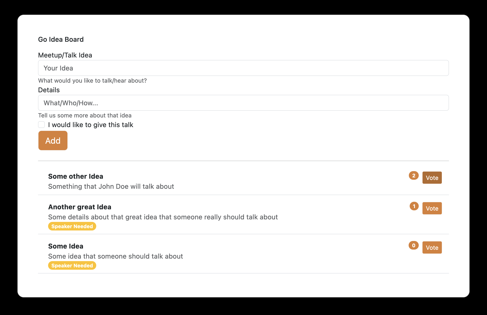

# What is this? 

A very WIP proof-of-concept of creating a simple idea collection and voting web application using vanilla Go and bootstrap.

Why? Because I was looking for a simple app like that to collect ideas for a meetup and figured "how hard can it be?"

